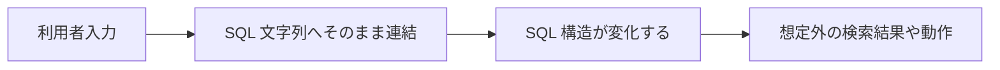
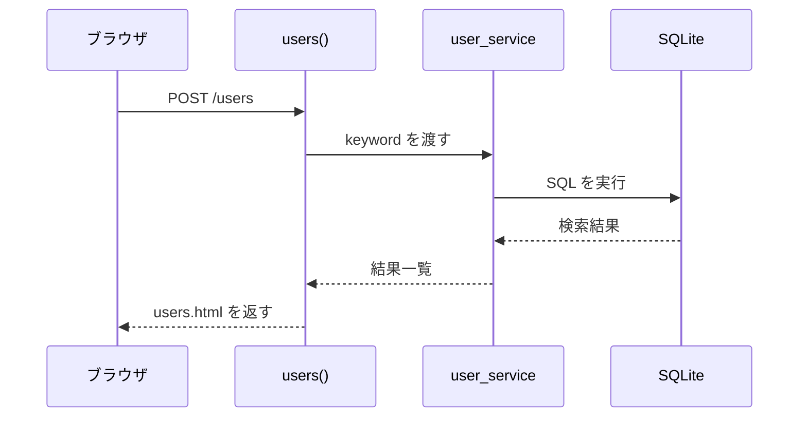
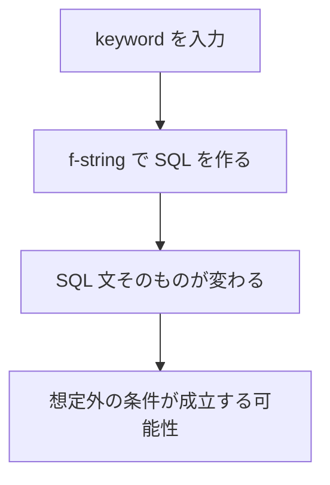
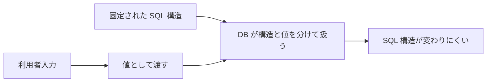

# 第4回
## SQLインジェクション

- 科目: Web アプリケーション脆弱性演習
- テーマ: SQLインジェクションの原理と対策を理解する
- 目標: 危険な SQL の組み立て方と安全な組み立て方を比較して説明できる

---

# 今日の到達目標

- SQLインジェクションとは何か説明できる
- なぜ文字列連結が危険か説明できる
- パラメータ化クエリの意味を説明できる
- `search_users_safe()` と `search_users_unsafe()` の違いを説明できる
- `/users` を使って安全版と脆弱版を比較できる

---

# 今日扱う内容

1. 前回の復習
2. SQLインジェクションの考え方
3. 危険な実装
4. 安全な実装
5. 教材アプリでの比較
6. 演習

---

# 前回の復習

- 認証状態は Cookie 型またはサーバセッション型で保持できる
- `lab-settings` で認証方式を切り替えられる
- `/debug/session` で状態を観察できる

今回の焦点:

- 入力値を SQL にどう渡すか

---

# SQLインジェクションとは

- 利用者入力が SQL 文の一部として解釈されてしまう問題
- 本来想定していない条件や構文が実行される

代表的な原因:

- SQL 文を文字列連結で組み立てる

---

# どこが危険か

危険な考え方:

- 入力値をそのまま SQL 文に埋め込む

安全な考え方:

- SQL の構造と値を分ける
- 値はプレースホルダで渡す

---

# SQLインジェクションのイメージ



---

# 教材アプリで扱う対象

今回使うのは `/users` である。

- 入力:
  - ユーザ名の検索キーワード
- 安全版:
  - `search_users_safe()`
- 脆弱版:
  - `search_users_unsafe()`

`lab-settings` で safe / vulnerable を切り替える。

---

# `/users` の流れ



---

# 危険な実装の例

```python
def search_users_unsafe(keyword):
    query = f"""
        SELECT id, username, password, role, display_name, bio
        FROM users
        WHERE username LIKE '%{keyword}%'
        ORDER BY id
    """
    with get_connection() as conn:
        rows = conn.execute(query).fetchall()
    return [row_to_user(row) for row in rows], query
```

ポイント:

- `keyword` をそのまま SQL に埋め込んでいる
- 入力値が SQL 構造に影響できる

---

# 危険な実装の問題



---

# 安全な実装の例

```python
def search_users_safe(keyword):
    like_query = f"%{keyword}%"
    with get_connection() as conn:
        rows = conn.execute(
            """
            SELECT id, username, password, role, display_name, bio
            FROM users
            WHERE username LIKE ?
            ORDER BY id
            """,
            (like_query,),
        ).fetchall()
    return [row_to_user(row) for row in rows]
```

ポイント:

- SQL 文の構造は固定されている
- 値は `?` の位置に別で渡す

---

# 安全な実装の考え方



---

# 危険版と安全版の比較

| 観点 | 危険版 | 安全版 |
|---|---|---|
| SQL の作り方 | 文字列連結 | プレースホルダ |
| 入力値の扱い | SQL の一部になる | 値として渡される |
| 構造変化の危険 | 高い | 低い |
| 教材アプリの関数 | `search_users_unsafe()` | `search_users_safe()` |

---

# コード解説 1
## `/users` の切替

```python
if sqli_enabled():
    results, unsafe_query = search_users_unsafe(keyword)
else:
    results = search_users_safe(keyword)
```

ポイント:

- `lab-settings` の状態で安全版と脆弱版を切り替える
- 同じ画面で比較できる

---

# コード解説 2
## `users.html`

```html

<h3>Executed Query</h3>
<pre>{{ unsafe_query }}</pre>

```

ポイント:

- 脆弱版では実行された SQL 文を表示する
- どのような SQL が作られたか観察できる

---

# 画面で何を見るか

`/users` では次を見る。

- Search mode
- 入力した keyword
- 検索結果
- 脆弱版なら Executed Query

観察の狙い:

- 入力値で SQL 文が変わるかどうか

---

# lab-settings での切替

- `SQL injection mode`
  - `safe`
  - `vulnerable`

授業の進め方:

1. まず safe で確認
2. 次に vulnerable へ切替
3. 実行される SQL の違いを観察

---

# ハンズオン 1
## 安全版を確認する

1. `Lab Settings` を開く
2. `SQL injection mode` を `safe` にする
3. `/users` を開く
4. いくつかの文字列で検索する

確認すること:

- 検索結果はどう変わるか
- SQL 文は表示されるか

---

# ハンズオン 2
## 脆弱版を確認する

1. `Lab Settings` を開く
2. `SQL injection mode` を `vulnerable` にする
3. `/users` を開く
4. 入力と Executed Query を比べる

確認すること:

- SQL 文が画面に出るか
- 入力値が SQL にそのまま入っているか

---

# ハンズオン 3
## safe と vulnerable を比較する

次の表を埋める。

| 観察項目 | safe | vulnerable |
|---|---|---|
| SQL の表示 |  |  |
| 入力値の扱い |  |  |
| 危険性 |  |  |

---

# 演習 1
## `search_users_unsafe()` を読む

次を答える。

1. SQL 文はどこで作られているか
2. `keyword` はどこに入っているか
3. なぜ危険か

---

# 演習 2
## `search_users_safe()` を読む

次を答える。

1. `?` は何を意味しているか
2. 値はどこで渡しているか
3. なぜ危険性が下がるのか

---

# 演習 3
## `/users` のルーティングを読む

`app/routes.py` を見て説明する。

1. どこで safe / vulnerable を切り替えているか
2. どこでテンプレートへ結果を渡しているか
3. `unsafe_query` は何のためにあるか

---

# 演習 4
## 自分の言葉で説明する

次の問いに答える。

1. SQLインジェクションは何が問題か
2. 文字列連結が危険な理由は何か
3. プレースホルダを使う利点は何か

---

# 今日のまとめ

- SQLインジェクションは入力値が SQL の構造に影響する問題
- 文字列連結は危険である
- プレースホルダを使うと安全性が上がる
- この教材では `/users` で安全版と脆弱版を比較できる
- `search_users_safe()` と `search_users_unsafe()` の差を読めることが重要

---

# 次回予告

- XSS
- CSRF
- ブラウザ側で起こる脆弱性

---

# 宿題

1. `search_users_safe()` と `search_users_unsafe()` の違いを 3 点書く
2. `/users` の脆弱版で SQL 文が表示される意味を説明する
3. なぜプレースホルダが重要なのかを文章で書く

---

# 教員メモ

- 実際の攻撃文字列を無理に細かく広げなくてもよい
- まずは「入力値が SQL 文そのものに入る」ことを理解させる
- safe と vulnerable の差分を丁寧に読むことを重視する
- 次回の XSS / CSRF とつなぐため、「入力値の扱い」が中心だと強調する
