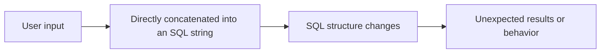
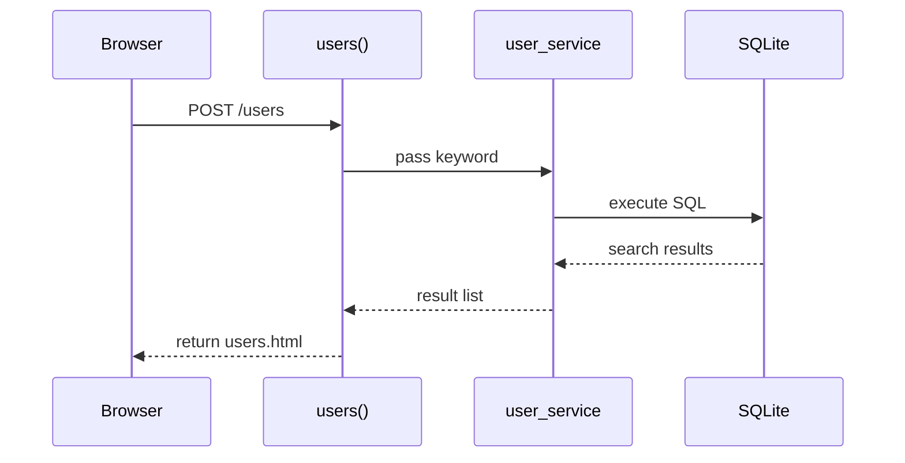
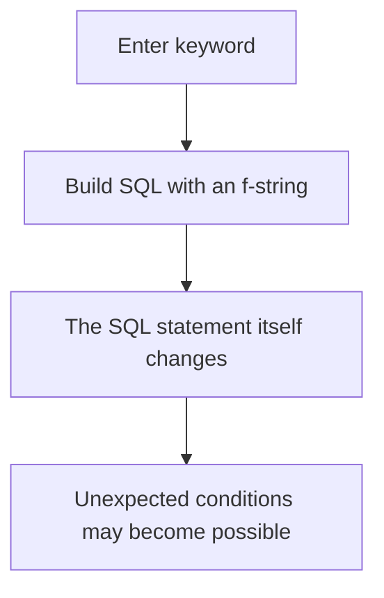
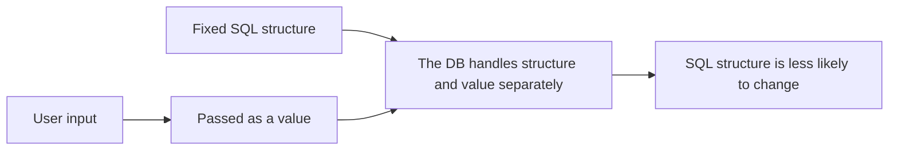

# Lecture 4
## SQL Injection

- Course: Web Application Vulnerability Lab
- Theme: Understanding the principle and mitigation of SQL injection
- Goal: Compare dangerous and safe ways of building SQL queries

---

# Learning Goals for Today

- Explain what SQL injection is
- Explain why string concatenation is dangerous
- Explain the meaning of parameterized queries
- Explain the difference between `search_users_safe()` and `search_users_unsafe()`
- Compare safe and vulnerable modes using `/users`

---

# Topics for Today

1. Review of the previous class
2. The idea of SQL injection
3. Dangerous implementation
4. Safe implementation
5. Comparison in the teaching app
6. Exercises

---

# Review of Last Time

- Authentication state can be kept in cookie-based or server-session-based form
- `lab-settings` can switch the authentication mode
- `/debug/session` can be used to observe state

Today's focus:

- How input values are passed into SQL

---

# What Is SQL Injection?

- A problem where user input is interpreted as part of an SQL statement
- Unexpected conditions or syntax may be executed

Typical cause:

- Building SQL statements through string concatenation

---

# Where Is the Risk?

Dangerous idea:

- Insert user input directly into an SQL string

Safe idea:

- Separate SQL structure from values
- Pass values through placeholders

---

# Image of SQL Injection



---

# Target in This Teaching App

In this lecture, we use `/users`.

- Input:
  - A keyword for username search
- Safe mode:
  - `search_users_safe()`
- Vulnerable mode:
  - `search_users_unsafe()`

The mode is switched from `lab-settings`.

---

# Flow of `/users`



---

# Example of a Dangerous Implementation

```python
def search_users_unsafe(keyword):
    query = f"""
        SELECT id, username, password, role, display_name, bio
        FROM users
        WHERE username LIKE '%{keyword}%'
        ORDER BY id
    """
    with get_connection() as conn:
        rows = conn.execute(query).fetchall()
    return [row_to_user(row) for row in rows], query
```

Key points:

- `keyword` is inserted directly into the SQL string
- User input can affect the SQL structure

---

# Why the Dangerous Implementation Is Risky



---

# Example of a Safe Implementation

```python
def search_users_safe(keyword):
    like_query = f"%{keyword}%"
    with get_connection() as conn:
        rows = conn.execute(
            """
            SELECT id, username, password, role, display_name, bio
            FROM users
            WHERE username LIKE ?
            ORDER BY id
            """,
            (like_query,),
        ).fetchall()
    return [row_to_user(row) for row in rows]
```

Key points:

- The SQL structure stays fixed
- The value is passed separately at the `?` placeholder

---

# The Idea Behind the Safe Implementation



---

# Comparison of Vulnerable and Safe Modes

| Viewpoint | Vulnerable | Safe |
|---|---|---|
| How SQL is built | String concatenation | Placeholder |
| How input is treated | Becomes part of SQL | Passed as a value |
| Risk of structure change | High | Lower |
| Teaching app function | `search_users_unsafe()` | `search_users_safe()` |

---

# Code Explanation 1
## Switching in `/users`

```python
if sqli_enabled():
    results, unsafe_query = search_users_unsafe(keyword)
else:
    results = search_users_safe(keyword)
```

Key points:

- `lab-settings` decides whether safe or vulnerable mode is active
- The same page can be used for comparison

---

# Code Explanation 2
## `users.html`

```html

<h3>Executed Query</h3>
<pre>{{ unsafe_query }}</pre>

```

Key points:

- In vulnerable mode, the executed SQL is shown
- Students can observe how the SQL string was built

---

# What to Observe on the Page

On `/users`, look at:

- Search mode
- The input keyword
- Search results
- `Executed Query` in vulnerable mode

Purpose:

- To see whether input changes the SQL statement itself

---

# Switching from lab-settings

- `SQL injection mode`
  - `safe`
  - `vulnerable`

Suggested class flow:

1. Check safe mode first
2. Then switch to vulnerable
3. Observe the difference in the executed SQL

---

# Hands-On 1
## Check the Safe Mode

1. Open `Lab Settings`
2. Set `SQL injection mode` to `safe`
3. Open `/users`
4. Search with a few strings

Check:

- How the results change
- Whether SQL is displayed

---

# Hands-On 2
## Check the Vulnerable Mode

1. Open `Lab Settings`
2. Set `SQL injection mode` to `vulnerable`
3. Open `/users`
4. Compare the input and `Executed Query`

Check:

- Whether the SQL statement appears on the page
- Whether the input value is inserted directly into the SQL

---

# Hands-On 3
## Compare Safe and Vulnerable

Fill in the table.

| Observation | safe | vulnerable |
|---|---|---|
| SQL display |  |  |
| How input is handled |  |  |
| Risk |  |  |

---

# Exercise 1
## Read `search_users_unsafe()`

Answer:

1. Where is the SQL string built?
2. Where does `keyword` appear?
3. Why is this dangerous?

---

# Exercise 2
## Read `search_users_safe()`

Answer:

1. What does `?` mean?
2. Where is the value passed?
3. Why does this reduce risk?

---

# Exercise 3
## Read the `/users` Route

Look at `app/routes.py` and explain:

1. Where safe and vulnerable mode are switched
2. Where the results are passed to the template
3. What `unsafe_query` is for

---

# Exercise 4
## Explain in Your Own Words

Answer:

1. What is the core problem in SQL injection?
2. Why is string concatenation dangerous?
3. What is the advantage of placeholders?

---

# Summary

- SQL injection happens when input affects SQL structure
- String concatenation is dangerous
- Placeholders improve safety
- This teaching app lets students compare safe and vulnerable modes on `/users`
- Understanding the difference between `search_users_safe()` and `search_users_unsafe()` is essential

---

# Next Time

- XSS
- CSRF
- Browser-side vulnerabilities

---

# Homework

1. Write three differences between `search_users_safe()` and `search_users_unsafe()`
2. Explain why displaying the SQL query matters in vulnerable mode
3. Write why placeholders are important

---

# Instructor Notes

- It is not necessary to go deep into attack strings in the first explanation
- Focus first on the idea that input becomes part of the SQL statement
- Carefully compare safe and vulnerable code side by side
- Connect this lecture to the next one by emphasizing input handling
