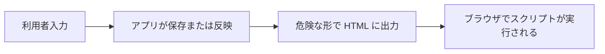
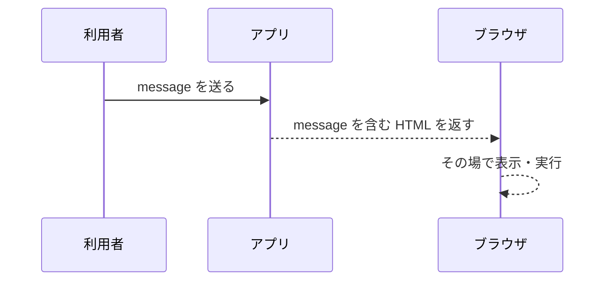
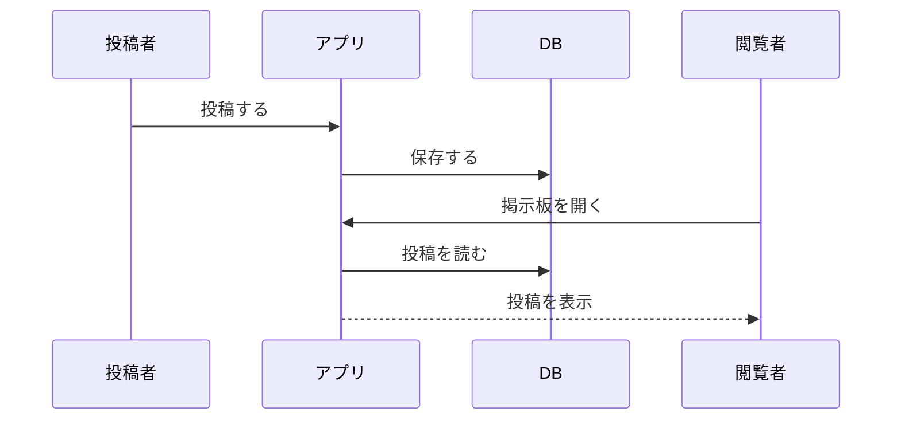
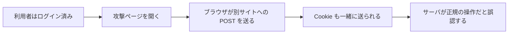
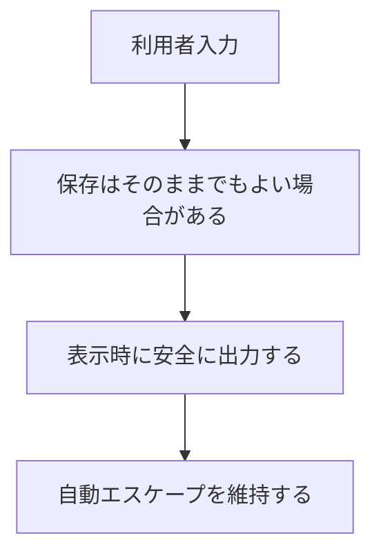
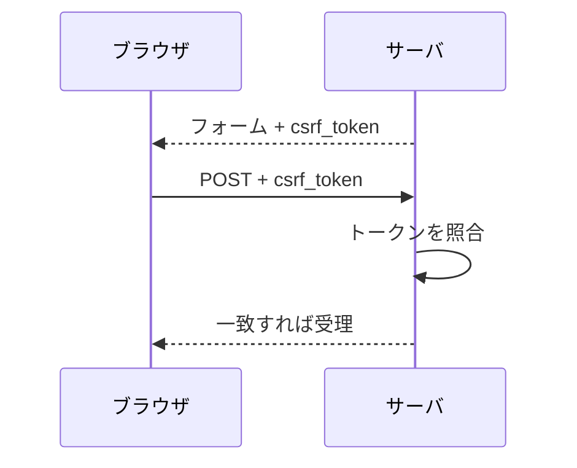

# 第5回
## XSS と CSRF

- 科目: Web アプリケーション脆弱性演習
- テーマ: ブラウザ側で起こる脆弱性を理解する
- 目標: XSS と CSRF の違い、成立条件、基本対策を説明できる

---

# 今日の到達目標

- XSS と CSRF の違いを説明できる
- 反射型 XSS と蓄積型 XSS の違いを説明できる
- なぜ `|safe` が危険になりうるか説明できる
- なぜ CSRF トークンが必要か説明できる
- `/reflect`、`/board`、`/logout` を使って現象を比較できる

---

# 今日扱う内容

1. 前回の復習
2. XSS の基本
3. 反射型 XSS
4. 蓄積型 XSS
5. CSRF の基本
6. 教材アプリでの比較
7. 演習

---

# 前回の復習

- SQLインジェクションは入力値が SQL 構造に影響する問題
- 文字列連結は危険
- プレースホルダで安全性を高められる

今回の焦点:

- ブラウザ側で入力や表示がどう悪用されるか

---

# XSS とは

XSS:

- 悪意あるスクリプトがページ内で実行される問題

主な原因:

- 利用者入力を危険な形で HTML に埋め込む

影響例:

- 画面改ざん
- Cookie 参照の試み
- 他ページへの不正操作

---

# XSS の全体像



---

# 反射型 XSS と蓄積型 XSS

- 反射型 XSS
  - 入力がその場で応答に反映される
  - 今回の教材では `/reflect`
- 蓄積型 XSS
  - 入力が保存され、後で他人の画面でも表示される
  - 今回の教材では `/board`

---

# 反射型 XSS のイメージ



---

# 蓄積型 XSS のイメージ



---

# CSRF とは

CSRF:

- 利用者が意図していないリクエストを、ログイン済みの状態で送らせる問題

主な条件:

- 利用者がすでにログインしている
- ブラウザが認証に使う Cookie を自動送信する
- サーバ側にリクエストの正当性確認がない

---

# CSRF の全体像



---

# XSS と CSRF の違い

| 観点 | XSS | CSRF |
|---|---|---|
| 主な問題 | 悪意あるスクリプト実行 | 意図しないリクエスト送信 |
| 主な場所 | ページの出力 | リクエスト処理 |
| 中心となる要素 | HTML / JavaScript | Cookie / リクエスト |
| 今回の教材 | `/reflect`, `/board` | `/logout`, `/board`, `csrf_demo_server.py` |

---

# 教材アプリで使うページ

- `/reflect`
  - 反射型 XSS の比較
- `/board`
  - 蓄積型 XSS の比較
- `/lab-settings`
  - reflected / stored XSS と CSRF を切替
- `csrf_demo_server.py`
  - 別ポートの攻撃側サーバ

---

# 反射型 XSS のコード

```html

<div class="post-body">{{ message | safe }}</div>

<div class="post-body">{{ message }}</div>

```

ポイント:

- `|safe` を付けるとエスケープを外す
- 安全版では通常の自動エスケープを使う

---

# 蓄積型 XSS のコード

```html

<div class="post-body">{{ post["body"] | safe }}</div>

<div class="post-body">{{ post["body"] }}</div>

```

ポイント:

- 保存された本文を表示している
- だから他人が見るページでも影響が出る

---

# XSS 防止の基本



基本方針:

- まずは表示時に危険な解釈をさせない

---

# CSRF 保護のコード

```python
def csrf_protect(view_func):
    @wraps(view_func)
    def wrapped(*args, **kwargs):
        if request.method == "POST" and csrf_protection_enabled():
            submitted_token = request.form.get("csrf_token", "")
            if not csrf_token_is_valid(submitted_token):
                abort(403)
        return view_func(*args, **kwargs)
```

ポイント:

- POST のときだけ検証している
- トークンがなければ拒否する

---

# CSRF トークンのイメージ



---

# フォーム側のコード

```html
<form action="{{ url_for('main.board') }}" method="post" class="stack">
  <input type="hidden" name="csrf_token" value="{{ csrf_token }}">
  ...
</form>
```

ポイント:

- hidden フィールドでトークンを送る
- サーバ側検証とセットで意味を持つ

---

# CSRF が成立しやすい理由

- ブラウザは Cookie を自動送信する
- サーバが「本当にこの画面から送られたか」を確認しないと危険

今回の教材では:

- `CSRF protection`
  - `enabled`
  - `disabled`

を `lab-settings` で切り替える

---

# 教材アプリでの比較

| ページ | 安全版 | 脆弱版 |
|---|---|---|
| `/reflect` | 自動エスケープ | `|safe` |
| `/board` | 自動エスケープ | `|safe` |
| `/logout` / `/board` などの POST | CSRF トークン検証 | トークン検証なし |

---

# ハンズオン 1
## 反射型 XSS を確認する

1. `Lab Settings` を開く
2. `Reflected XSS mode` を `safe` にする
3. `/reflect` を開く
4. `message` を変えて表示を確認する
5. 次に `vulnerable` に切り替える
6. 表示の違いを比較する

Moodle回答指示:

- 回答形式: 提出不要
- 教員が回収する場合のみ: safe と vulnerable の見え方の違いを1文で書く

---

# ハンズオン 2
## 蓄積型 XSS を確認する

1. `Lab Settings` を開く
2. `Stored XSS mode` を `safe` にする
3. `/board` に投稿する
4. 表示を確認する
5. `vulnerable` に切り替える
6. 再度表示を比較する

Moodle回答指示:

- 回答形式: 提出不要
- 教員が回収する場合のみ: 投稿表示の違いを1文で書く

---

# ハンズオン 3
## CSRF を確認する

1. メインアプリにログインする
2. `CSRF protection` を `disabled` にする
3. `csrf_demo_server.py` を起動する
4. 攻撃ページを開く
5. 次に `enabled` にして再度試す

確認すること:

- 成功するか失敗するか
- どこが違いを生んでいるか

Moodle回答指示:

- 回答形式: 提出不要
- 教員が回収する場合のみ: CSRF 保護 ON/OFF の差を1-2文で書く

---

# 演習 1
## `/reflect` を読む

次を答える。

1. どこで `message` を受け取っているか
2. どこで `|safe` を使っているか
3. なぜ危険になりうるか

Moodle回答指示:

- 回答形式: 作文
- 文字数目安: 90-160字
- 必ず書くこと: 3問すべてに番号付きで答える

---

# 演習 2
## `/board` を読む

次を答える。

1. 投稿はどこで保存されるか
2. 投稿本文はどこで表示されるか
3. なぜ蓄積型 XSS になるのか

Moodle回答指示:

- 回答形式: 作文
- 文字数目安: 90-160字
- 必ず書くこと: 3問すべてに番号付きで答える

---

# 演習 3
## `csrf_protect` を読む

次を答える。

1. どの条件でトークンを検証するか
2. トークンが不正なときどうなるか
3. なぜ `hidden` フィールドが必要か

Moodle回答指示:

- 回答形式: 作文
- 文字数目安: 90-160字
- 必ず書くこと: 3問すべてに番号付きで答える

---

# 演習 4
## XSS と CSRF を比較する

次の問いに答える。

1. XSS は何を悪用するか
2. CSRF は何を悪用するか
3. なぜ両者は別の対策が必要か

Moodle回答指示:

- 回答形式: 作文
- 文字数目安: 120-200字
- 必ず書くこと: 3問すべてに番号付きで答える

---

# 今日のまとめ

- XSS は危険な出力によるスクリプト実行の問題
- 反射型と蓄積型では現れ方が異なる
- `|safe` は危険になることがある
- CSRF はログイン済みブラウザを悪用する問題
- CSRF トークン検証は基本対策である

---

# 次回予告

- セッション固定
- Cookie 属性
- 認証・セッション管理の不備

---

# 宿題

1. 反射型 XSS と蓄積型 XSS の違いを説明する
2. なぜ `|safe` が危険になりうるかを書く
3. CSRF トークンが必要な理由を文章で書く

Moodle回答指示:

- 回答形式: 作文
- 文字数目安: 160-260字
- 必ず書くこと: 3問すべてに番号付きで答える

---

# 教員メモ

- XSS と CSRF は混同しやすいので差を丁寧に出す
- まずは「何が実行されるか」「誰のブラウザが使われるか」を整理する
- safe / vulnerable の切替を実演すると理解が進みやすい
- 次回のセッション固定や Cookie 属性へつなげる
