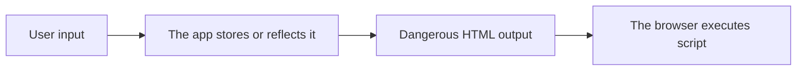
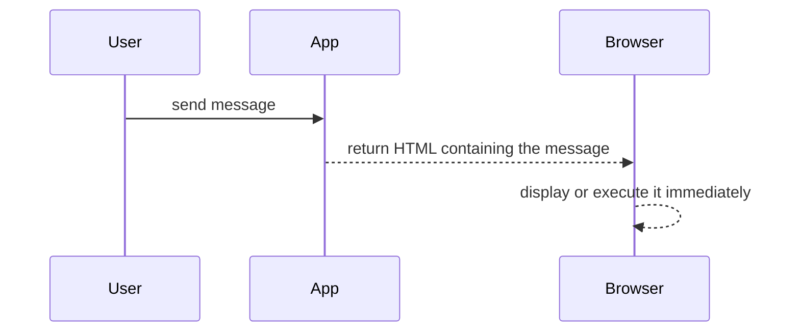
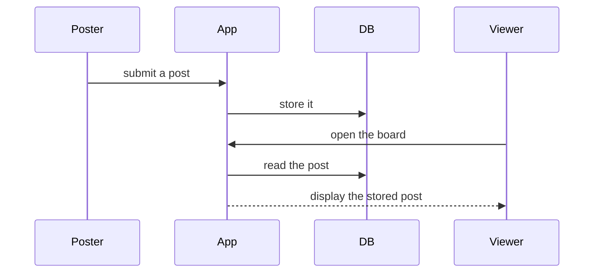
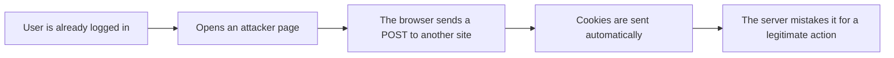
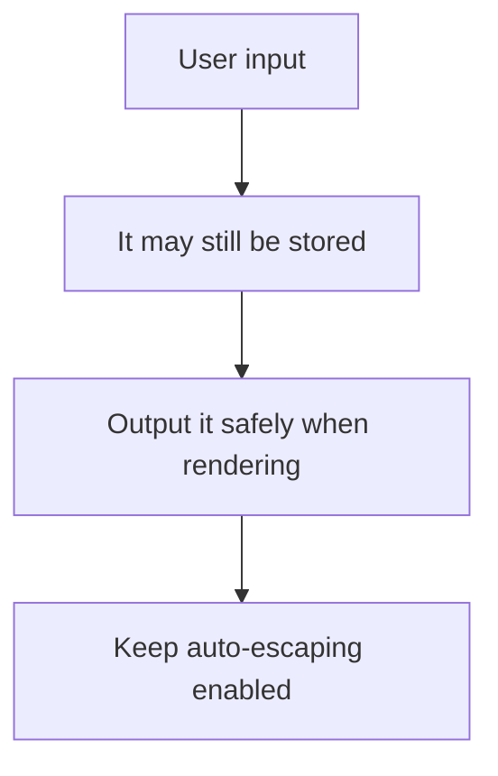
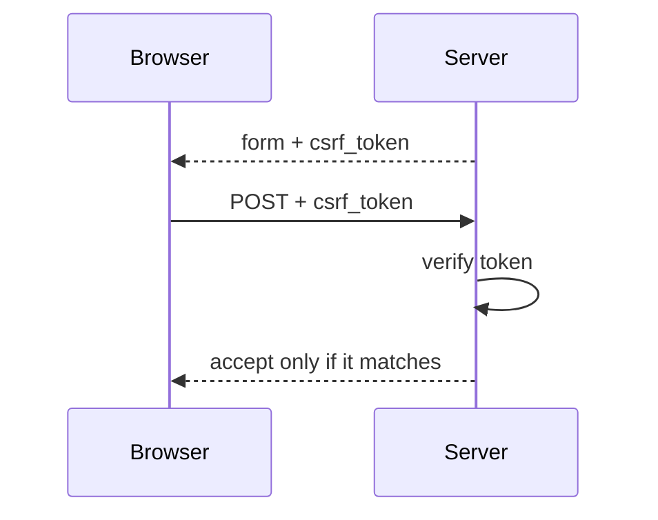

# Lecture 5
## XSS and CSRF

- Course: Web Application Vulnerability Lab
- Theme: Understanding browser-side vulnerabilities
- Goal: Explain the difference, conditions, and basic defenses of XSS and CSRF

---

# Learning Goals for Today

- Explain the difference between XSS and CSRF
- Explain the difference between reflected XSS and stored XSS
- Explain why `|safe` can become dangerous
- Explain why CSRF tokens are needed
- Compare behavior using `/reflect`, `/board`, and `/logout`

---

# Topics for Today

1. Review of the previous class
2. Basics of XSS
3. Reflected XSS
4. Stored XSS
5. Basics of CSRF
6. Comparison in the teaching app
7. Exercises

---

# Review of Last Time

- SQL injection happens when input affects SQL structure
- String concatenation is dangerous
- Placeholders improve safety

Today's focus:

- How input and output are abused on the browser side

---

# What Is XSS?

XSS:

- A problem where malicious scripts execute inside a page

Typical cause:

- User input is inserted into HTML in a dangerous way

Possible effects:

- Page defacement
- Attempts to read cookies
- Unauthorized actions in the browser

---

# Overall Image of XSS



---

# Reflected XSS and Stored XSS

- Reflected XSS
  - Input is reflected immediately in the response
  - In this app: `/reflect`
- Stored XSS
  - Input is stored and later shown to other users
  - In this app: `/board`

---

# Image of Reflected XSS



---

# Image of Stored XSS



---

# What Is CSRF?

CSRF:

- A problem where the browser sends unintended requests while the user is already logged in

Typical conditions:

- The user is already logged in
- The browser automatically sends authentication cookies
- The server does not verify that the request is legitimate

---

# Overall Image of CSRF



---

# Difference Between XSS and CSRF

| Viewpoint | XSS | CSRF |
|---|---|---|
| Main problem | Script execution | Unintended request sending |
| Main location | Page output | Request processing |
| Main element | HTML / JavaScript | Cookie / request |
| Teaching app example | `/reflect`, `/board` | `/logout`, `/board`, `csrf_demo_server.py` |

---

# Pages Used in This App

- `/reflect`
  - Compare reflected XSS modes
- `/board`
  - Compare stored XSS modes
- `/lab-settings`
  - Switch reflected / stored XSS and CSRF
- `csrf_demo_server.py`
  - Separate attacker-side server

---

# Code for Reflected XSS

```html

<div class="post-body">{{ message | safe }}</div>

<div class="post-body">{{ message }}</div>

```

Key points:

- `|safe` disables escaping
- Safe mode uses normal auto-escaping

---

# Code for Stored XSS

```html

<div class="post-body">{{ post["body"] | safe }}</div>

<div class="post-body">{{ post["body"] }}</div>

```

Key points:

- Stored post content is being displayed
- That is why the effect can reach another user's page

---

# Basic XSS Prevention Idea



Basic policy:

- Prevent dangerous interpretation at output time

---

# Code for CSRF Protection

```python
def csrf_protect(view_func):
    @wraps(view_func)
    def wrapped(*args, **kwargs):
        if request.method == "POST" and csrf_protection_enabled():
            submitted_token = request.form.get("csrf_token", "")
            if not csrf_token_is_valid(submitted_token):
                abort(403)
        return view_func(*args, **kwargs)
```

Key points:

- It verifies only for POST requests
- The request is rejected if the token is invalid

---

# Image of a CSRF Token



---

# Code on the Form Side

```html
<form action="{{ url_for('main.board') }}" method="post" class="stack">
  <input type="hidden" name="csrf_token" value="{{ csrf_token }}">
  ...
</form>
```

Key points:

- The token is sent as a hidden field
- It matters only together with server-side verification

---

# Why CSRF Can Happen Easily

- Browsers send cookies automatically
- If the server does not check whether the request came from the expected form, it is dangerous

In this app:

- `CSRF protection`
  - `enabled`
  - `disabled`

can be switched in `lab-settings`

---

# Comparison in the Teaching App

| Page | Safe mode | Vulnerable mode |
|---|---|---|
| `/reflect` | Auto-escaped | `|safe` |
| `/board` | Auto-escaped | `|safe` |
| POST actions such as `/logout` / `/board` | CSRF token checked | No token check |

---

# Hands-On 1
## Check Reflected XSS

1. Open `Lab Settings`
2. Set `Reflected XSS mode` to `safe`
3. Open `/reflect`
4. Change `message` and observe the output
5. Then switch to `vulnerable`
6. Compare the output

Moodle answer instructions:

- Response type: No submission required
- If the instructor collects it: Write one sentence about the visible difference between safe and vulnerable mode

---

# Hands-On 2
## Check Stored XSS

1. Open `Lab Settings`
2. Set `Stored XSS mode` to `safe`
3. Submit a post on `/board`
4. Check the display
5. Switch to `vulnerable`
6. Compare the display again

Moodle answer instructions:

- Response type: No submission required
- If the instructor collects it: Write one sentence about the difference in how the post is displayed

---

# Hands-On 3
## Check CSRF

1. Log in to the main app
2. Set `CSRF protection` to `disabled`
3. Start `csrf_demo_server.py`
4. Open the attacker page
5. Then set protection to `enabled` and try again

Check:

- Whether the action succeeds or fails
- What creates that difference

Moodle answer instructions:

- Response type: No submission required
- If the instructor collects it: Write 1-2 short sentences about the difference between CSRF protection ON and OFF

---

# Exercise 1
## Read `/reflect`

Answer:

1. Where is `message` received?
2. Where is `|safe` used?
3. Why can that become dangerous?

Moodle answer instructions:

- Response type: Essay
- Suggested length: 3 numbered lines
- Required items: Answer all 3 questions with numbers

---

# Exercise 2
## Read `/board`

Answer:

1. Where is the post stored?
2. Where is the post body displayed?
3. Why does this become stored XSS?

Moodle answer instructions:

- Response type: Essay
- Suggested length: 3 numbered lines
- Required items: Answer all 3 questions with numbers

---

# Exercise 3
## Read `csrf_protect`

Answer:

1. Under what condition is the token verified?
2. What happens when the token is invalid?
3. Why is the hidden field needed?

Moodle answer instructions:

- Response type: Essay
- Suggested length: 3 numbered lines
- Required items: Answer all 3 questions with numbers

---

# Exercise 4
## Compare XSS and CSRF

Answer:

1. What does XSS abuse?
2. What does CSRF abuse?
3. Why do they require different defenses?

Moodle answer instructions:

- Response type: Essay
- Suggested length: 4-6 short lines
- Required items: Answer all 3 questions with numbers

---

# Summary

- XSS is a script-execution problem caused by dangerous output
- Reflected and stored XSS appear in different ways
- `|safe` can become dangerous
- CSRF abuses a logged-in browser
- CSRF token verification is a basic defense

---

# Next Time

- Session fixation
- Cookie attributes
- Problems in authentication and session management

---

# Homework

1. Explain the difference between reflected XSS and stored XSS
2. Write why `|safe` can become dangerous
3. Write why a CSRF token is needed

Moodle answer instructions:

- Response type: Essay
- Suggested length: 6-8 short lines
- Required items: Answer all 3 questions with numbers

---

# Instructor Notes

- Students often confuse XSS and CSRF, so the difference should be made explicit
- Start with “what gets executed” and “whose browser is being used”
- Demonstrating safe / vulnerable switching makes the lesson clearer
- Connect this lecture to the next one on session fixation and cookie attributes
